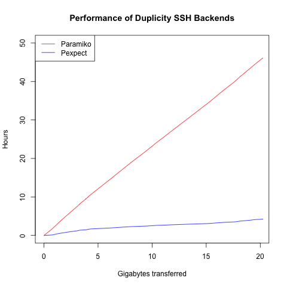

# Duplicity Performance

Code and data for this [post](https://www.cs.uic.edu/~s/musings/duplicity).



The `-ls` files were created by running
`ls -lv --time-style=full-iso` on the corresponding
Duplicity files.

The `.csv` files were created by running

```
awk 'BEGIN { print "Date, Time, Bytes" } /duplicity-full\..*\.vol[0-9]+\.difftar\.gpg/ { printf "%s, %s, %d\n", $6, $7, $5 }'
```

on the corresponding `-ls` files.
